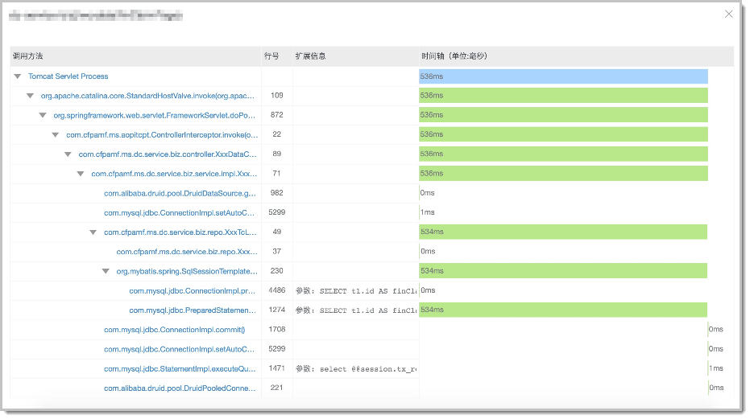
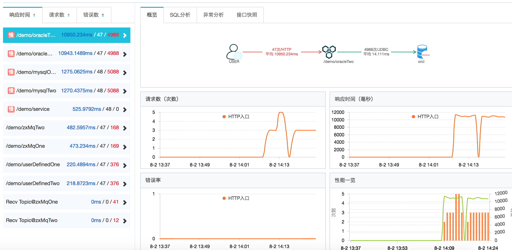
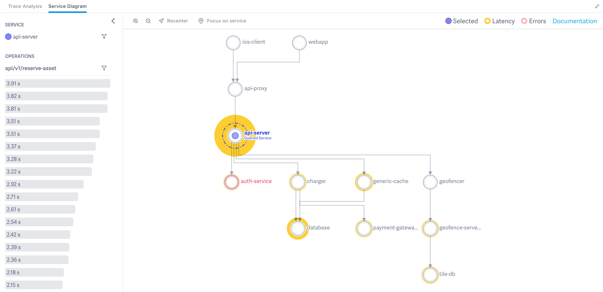
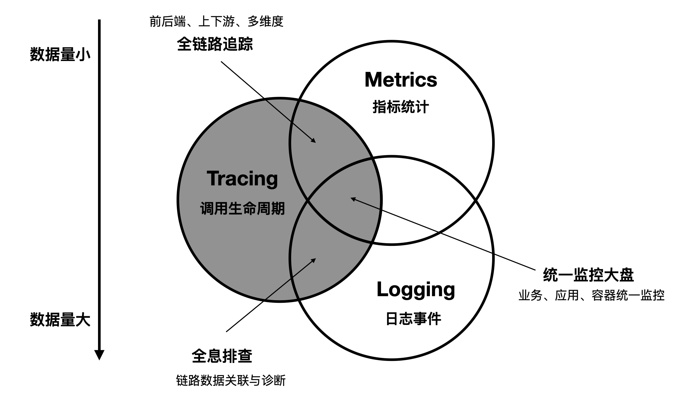
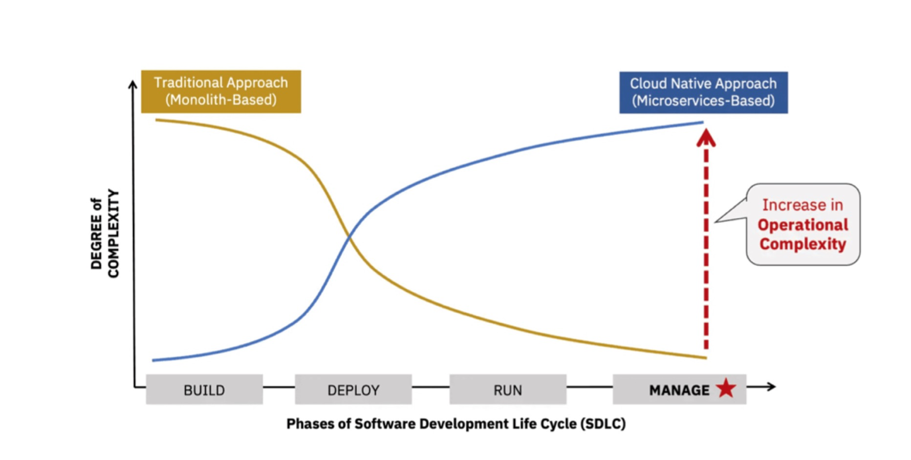

# 链路追踪（Tracing）其实很简单——分布式链路追踪的应用与兴起

> 作者：夏明（涯海）    
> 创作日期：2022-07-14  
> 专栏地址：[【稳定大于一切】](https://github.com/StabilityMan/StabilityGuide)  

分布式链路追踪已经被广泛应用于中大型企业的 IT 运维领域，为分布式应用的性能诊断与稳定性保障提供了有效的帮助。此外，分布式链路追踪的开源和商业化生态也发展迅猛，大量独立服务商或云厂商纷纷跟进，共同推动了分布式链路追踪技术的崛起。

## 分布式链路追踪的应用
狭义上的分布式链路追踪（Tracing），是指跟踪请求在分布式系统中的流转路径与状态，主要用途是协助开发运维人员进行故障诊断、容量预估、性能瓶颈分析与调用链路梳理等工作。技术实现上包含了数据埋点、采集、存储、分析、可视化等环节，形成了一套完整的技术体系。

而更广义的分布式链路追踪，则涵盖了由数据透传能力衍生的生态系统，比如全链路压测、微服务流量路由、业务场景链路拆分等。我们可以为调用链路赋予业务语义，也可以将一次调用生命周期内的所有数据进行关联整合，不再局限于链路数据本身。

由此可见，分布式链路追踪的应用场景广阔，潜力巨大，它的核心属性就是“关联”。然而，分布式链路追踪（Tracing）相对于统计指标（Metrics）和应用日志（Logging）来说更加难以理解，不容易运用，更难用好。接下来，我们通过一个生动形象的例子，了解下分布式链路追踪的经典用法，加深对它的技术本质的掌握。

### 游客、收费站和交通局
分布式链路追踪的用法有很多，但是最经典、最常用的有三种，还是以上一节的高速公路为例，不同角色对应着不同的用法。

* 游客，只关心自身的行程路线，需要途经哪些收费站点？行驶时间有多长？沿途是否有拥堵或危险路段等。
* 收费站，只关心自身站点的状态，比如站点吞吐量、平均过闸时间等，以便于提前安排检票口值班人数。
* 交通局，会将所有的出行记录汇总，提前估算整个高速公路网的出行流量、易拥堵路段、事故多发路段等，以便于提前疏通或加固问题路段，并给出合理的建议出行路线，有时还需要提前制定车辆限流策略等。

分布式链路追踪的应用和行程轨迹追踪类似，游客关心的是单次请求的轨迹回溯，收费站关注的是服务接口维度的汇总统计，旅游局则类似全局链路拓扑梳理。

#### 单请求轨迹回溯
单请求轨迹回溯是分布式链路追踪最基础的功能，它记录了一次请求经过的所有服务节点以及对应的节点状态信息（接口名称、耗时、状态码等），这就好比记录了游客自驾游时经过的所有收费站，以及沿途的路况与行驶时间等信息。单请求轨迹回溯是诊断特定请求异常/超时原因的有效手段，可以快速定位异常节点（拥堵的收费站）。

比较成熟的 Tracing 产品（比如阿里云的 [ARMS](https://help.aliyun.com/document_detail/64995.html)）除了基础的链路数据外，还会记录请求出入参、本地方法栈、关联 SQL 与异常堆栈等信息。这些细节信息就好比车辆的型号大小、驾驶员驾龄、是否醉酒、沿途每一路段的详细路况等，当调用不符合预期（行程异常）时，就可以精准的定位根因，如下图所示:

#### 服务监控
假如你是收费站的站长，你会关注哪些信息？收费站的车辆吞吐量？平均的过闸时间？车辆的来源与去向？同理，每一个服务节点，将途经的所有调用信息汇总后，就可以得到当前服务接口的吞吐量、耗时、来源与去向等统计指标。这些指标可以帮助我们快速识别当前服务的健康状态。在实际生产系统中，还可以与告警系统结合，实现风险的快速识别与处理，降低业务损失。

#### 链路拓扑
假如你是交通局的局长，你可能会关注全国高速公路网的整体运行状态，有哪些易拥堵或事故多发路段与站点，如何确保春运高峰期核心路段运行通畅，不会出现重大交通瘫痪事件等等。此时，你需要对所有的车辆行程轨迹进行汇总分析。

同理，链路拓扑就是将全局或某一入口服务的所有调用链路进行汇总，聚合为链路拓扑大图，进而分析当前链路的性能瓶颈点、易故障点等，提前进行性能优化或风险防控，还可以根据历史流量来指导未来（比如双11大促）的容量评估。

## 分布式链路追踪的发展现状
截止到 2021年，分布式链路追踪（Tracing）已经成为主流软件架构不可或缺的基础技术之一，它与指标（Metrics）、日志（Logging）并称为可观测领域的“三驾马车”，它们三者之间的关系如下图所示：

随着 Kubenetes 容器技术与云计算的普及，未来的软件架构会更加趋向分布式云、微服务化的方向，软件开发、部署成本将大幅下降，但是系统维护和问题诊断的难度却急剧上升。因此，分布式链路追踪以及由它提供的“确定性关联”价值将愈加凸显，如下图所示：

Tracing 在开源社区也颇受喜爱，拥有着旺盛的生命力，主流的开源标准包括 OpenTelemetry、OpenTracing、OpenCensus 和国内使用较多的 SkyWalking。其他影响力较强的实现还包括 Jaeger、Zipkin、Pinpoint等，如下图所示。

在商业化领域，Tracing 与 APM（Application Performance Mornitoring） 密切绑定，绝大部分厂商会面向应用视角提供更加全面、易用的 APM 服务，而不仅仅是 Tracing 服务。参考 2021 年 Gartner 评测机构给出的 APM 魔力象限，可以大致评估各大厂商的 APM 与 Tracing 产品能力，如下图所示。

截止 2021年，阿里巴巴 98% 的 Java 应用（上万级别）均已接入内部自研的分布式链路追踪系统 EagleEye；阿里云上有近万家企业在持续使用 ARMS 提供的分布式链路追踪服务。而从整个业界来看，无论是谷歌、亚马逊这样的国际大厂，还是新兴的互联网公司，或是传统企业，都在大规模接入和应用分布式链路追踪技术，Tracing 生态正在蓬勃发展。

## 推荐阅读
《链路追踪（Tracing）其实很简单》系列文章

- 1 什么是分布式链路追踪
	- [1.1 分布式链路追踪的起源](./链路追踪其实很简单——分布式链路追踪的起源.md)
	- [1.2 分布式链路追踪的诞生](./链路追踪其实很简单——分布式链路追踪的诞生.md)
	- [1.3 分布式链路追踪的应用与兴起](./链路追踪其实很简单——分布式链路追踪的应用与兴起.md)
	- [1.4 分布式链路追踪的挑战与限制](./链路追踪其实很简单——分布式链路追踪的挑战与限制.md)
- 2 分布式链路追踪的基础用法
	- [2.1 请求轨迹回溯](./链路追踪其实很简单——请求轨迹回溯.md)
	- [2.2 多维链路筛选](./链路追踪其实很简单——多维链路筛选.md)
	- [2.3 链路实时分析、监控与告警](./链路追踪其实很简单——链路实时分析_监控与告警.md)
	- [2.4 链路拓扑](./链路追踪其实很简单——链路拓扑.md)

## 推荐产品
- [阿里云 ARMS 可观测](https://help.aliyun.com/product/34364.html)
- [阿里云链路追踪](https://help.aliyun.com/document_detail/196681.html)

## 推荐社区
【稳定大于一切】打造国内稳定性领域知识库，**让无法解决的问题少一点点，让世界的确定性多一点点。**

- GitHub 专栏地址：[https://github.com/StabilityMan/StabilityGuide](https://github.com/StabilityMan/StabilityGuide)
- 微信公众号：万物可观测
- 钉钉交流群号：30000312
- 如果阅读本文有所收获，欢迎分享给身边的朋友，期待更多同学的加入！
