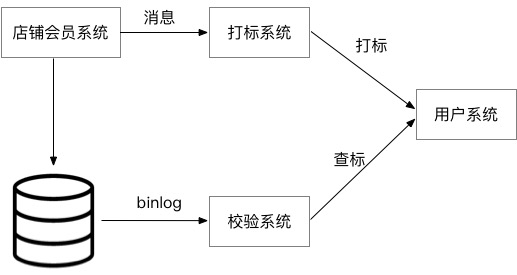
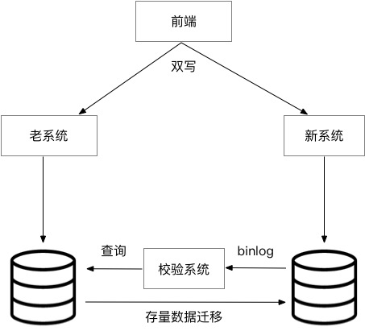

# 数据一致性检测应用场景与最佳实践
> 作者: 高超(龙多)   
> 创作日期: 2019-09-02  
> 专栏地址:[【稳定大于一切】](https://github.com/StabilityMan/StabilityGuide)  

随着业务规模的扩张，企业系统变得越来越复杂，在这种复杂的分布式系统架构下，难免会出现远程调用失败，消息发送失败，并发 Bug 等问题，这些问题最终会导致系统间的数据不一致，导致用户体验受损，用户利益受损，对平台来说就是产生资损。因此如何持续保障系统的业务稳定性对于企业来说是一个很重要的课题，本文旨在介绍一些常见业务应用场景下的业务数据一致性保障最佳实践。

## 目录
- [离线 or 在线，事前 or 事后](#离线-or-在线事前-or-事后)
- [数据一致性检测实践案例](#数据一致性检测实践案例)
- [加入我们](#加入我们)

## 离线 or 在线，事前 or 事后
应对业务数据不一致问题的常规操作是，配置定时任务，在每个固定时间点去拉取历史一段时间的数据出来进行比对，判断是否有数据故障出现，比如利用 Hadoop 做一些批处理 MapReduce 作业，这种离线计算的方式时效性比较差，对于电商系统或者对于实时性要求较高的系统来说，问题发现的越晚损失也就越大，所以我们需要一种在线的校验模式来实时发现数据不一致问题。

在线的校验模式指的是每出现一笔数据就进行一次比对，这种比对方式还可以分为事前和事后比对。

* 事前比对是一种业务强耦合的校验方式，我们在业务系统代码中进行类似 AOP 的操作，横插一段校验代码，如果校验发现问题，则阻断这次业务操作，这种模式虽然时效性很高，能够保证每一笔数据的正确性，但是因为和业务耦合的太重，很容易出现一些灾难性的问题，比如校验代码的性能差或者异常处理不正确，会直接导致业务操作受阻，影响正常业务活动。
* 事后校验严格上来说不能算是实时校验，因为校验的时间点滞后于真实的业务动作发生时间点，这算是一种准实时校验，这种校验的好处在于，可以和业务解耦，不阻断业务的正常进行，还能较为"实时"的发现数据不一致问题，并且在一些特殊场景下(比如异步业务，下面会介绍)只能使用事后校验，缺点也很明显，就是时效性相比于事前校验来说会比较差。

这里在啰嗦一句，可能读到这里，有些人会问，既然是业务动作发生之后再进行校验，它的意义还有多大呢？的确相比于事前校验来说，他并不能保证每一笔数据都正确，但是在实际操作中，像电商这种场景下，我们进行业务功能迭代，会经过日常环境 -> 预发环境 -> Beta测试 -> 线上环境的流程，尤其是在预发环境和 Beta 测试的情况下，一般会进行一些线上引流或者模拟数据测试，特点是量小，即使发生问题也只是局部不会引起灾难，那在这种场景下，事后校验的意义就显得很大，可以提前验证功能和数据的正确性，又不会对线上造成强耦合的影响；在功能完全上线后，事后校验的作用在于及时发现数据不一致问题，避免问题的进一步扩散。

综上所述，对于业务数据校验时效性不是那么高的场景下，离线校验是一种比较合适的方式，开发接入成本都较低，对于业务数据校验时效性有一些要求的场景下，事后校验是一种比较适合的方式，对于业务校验时效性要求非常严格，并且能够投入较多资源的情况下，事前校验比较适合。

## 数据一致性检测实践案例
### 【案例一】会员系统
某店铺会员入会业务，需要结合店铺系统、打标系统、会员系统进行入会退会操作，如下图所示:

在这个业务场景中，买家在店铺会员页发起入会申请，入会成功对外发送会员入会 MetaQ 消息，下游业务系统根据这个 MetaQ 消息，为该用户打上一个标签，用户在下单的时候就根据这个标签判断是否有优先购买的权利。既然有入会就有退会，退会同样发起 MetaQ 消息给用户进行去标操作。所以不管入会还是退会，业务上要求店铺系统的会员状态（入会还是退会）必须和用户系统的标签状态一致（有或者没有），一旦发现数据不一致，一个已经退会的用户如果还有用户会员标签，该用户就可以购买这个限购商品，这样就会造成商家资损。因此必须有对账业务对数据一致性进行强保证，一旦发现数据不一致，必须要通知相关人员进行数据核对，如有问题则进行数据订正。

这个案例在对账系统的选择上有如下几个要求:

1. 实时：必须当天尽快处理。
2. 可以报警。
3. 必须支持不同领域模型。
4. 接口调用需要有一定的延迟，以便下游系统处理完所有流程之后再校验。
5. 由于入会、退会 MetaQ 可能会有丢失或者乱序的情况，因此不可以根据该消息进行对账。

在这个业务场景下，我们可以看到，业务是异步的，会员系统发起入会操作后，并不是立刻就能在用户系统打标的，所以实时的事前校验并不适合这个场景，因为在会员系统发起入会操作的时候在用户系统中还查不到这个打标状态，需要延迟一段时间去查，所以只能用事后校验来做。

我们在这个场景的做法是：拉取店铺会员数据库的实时 Binlog 日志数据，给到校验系统，校验系统解析日志数据拿到要打标的会员 Id，并且延时一段时间后去会员系统查询这个会员的入会状态，和日志中的状态进行一致性比对，发现不一致则进行告警。

### 【案例二】新老库迁移
当新老系统需要进行更替的时候，经常会涉及到数据迁移，由于数据量非常大，而且不允许停机，所以迁移一定是一个循序渐进的过程，整个过程会分成两个部分，第一个部分是双写，保证新增数据两边同步。第二步是开始做存量数据迁移，通过后台任务慢慢跑。在这个过程中可能会出现部分字段没有同步，更新数据顺序错乱导致数据内容不一致的问题，所以需要对迁移进行数据的一致性检查，及时发现数据问题进行订正或者 Bug 修复。

由于我们的目的是将数据迁移到新系统，所以数据校验触发条件就是新系统有数据写入，这里可能有人会问如果老系统同步失败呢，那么新系统就不会有数据写入，就触发不了校验。这里就存在校验边界的问题，即我们假设同步系统是一定会同步成功的，如果同步失败的话不允许跳过会一直尝试重试同步，所以这里如果发生同步失败，同步会暂停并且打印出同步错误日志，这个就不是校验系统的问题了，我们会通过同步的进度或者同步日志来观察到这个现象。

所以我们在这个场景的做法是：接收新库的数据库变更 Binlog 日志数据，解析日志内容，通过这条数据 Id 去查询旧库的对应数据，进行数据内容的比对。由于双写的存在，一条数据可能会变更多次，这里就要求我们的校验必须是较为实时的进行，否则就会出现拿到的日志数据内容是旧的(这条数据又发生了更新)，导致查询老库的数据出现不一致的问题，其实算是一种误报。

## 推荐工具&产品
- [AHAS —— 阿里云应用高可用服务，提供企业级的流量控制、故障评测等高可用能力](https://help.aliyun.com/document_detail/101132.html)
- [APDS —— 阿里云应用发现服务，支持自动资产盘点，帮助企业实现快速上云搬站](https://apds.console.aliyun.com)

## 加入我们

【稳定大于一切】打造国内稳定性领域知识库，**让无法解决的问题少一点点，让世界的确定性多一点点**。

* [GitHub 地址](https://github.com/StabilityMan/StabilityGuide)
* 钉钉群号：23179349
* 如果阅读本文有所收获，欢迎分享给身边的朋友，期待更多同学的加入！
